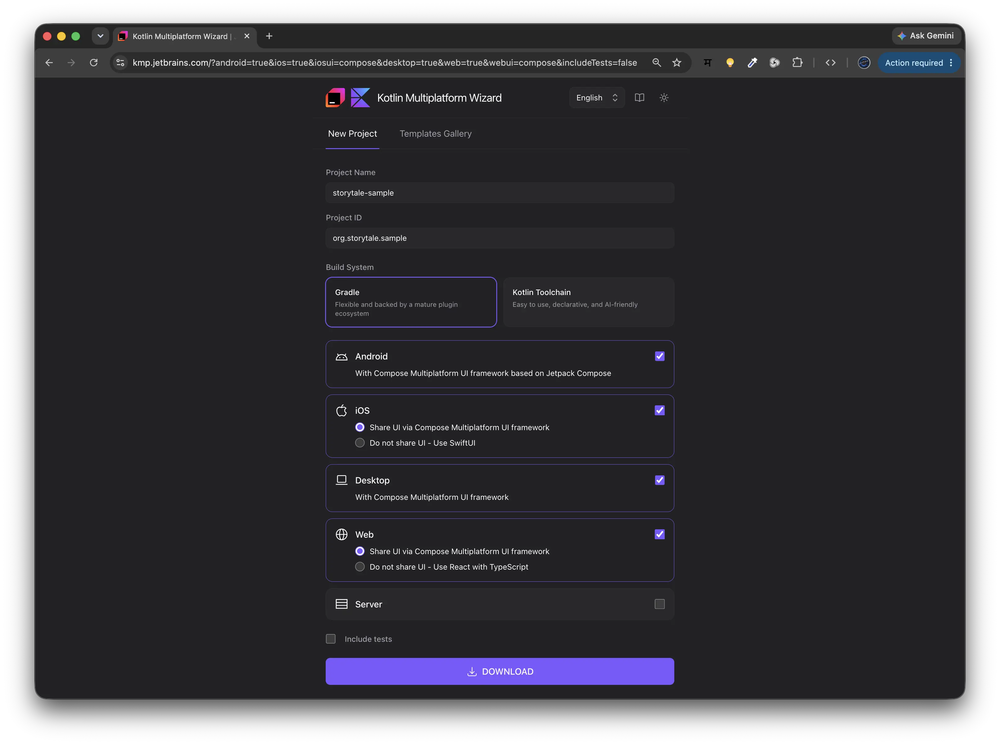
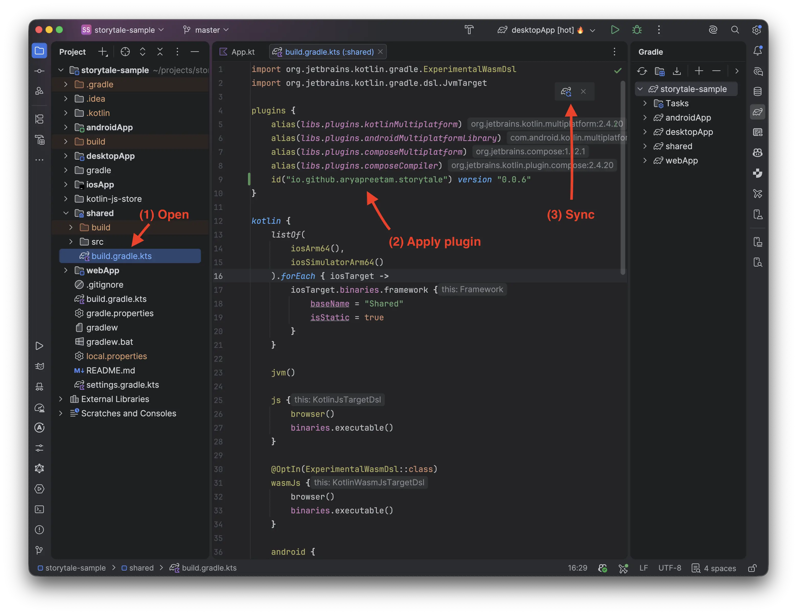
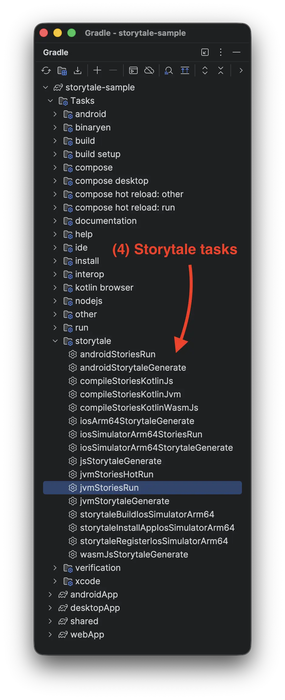
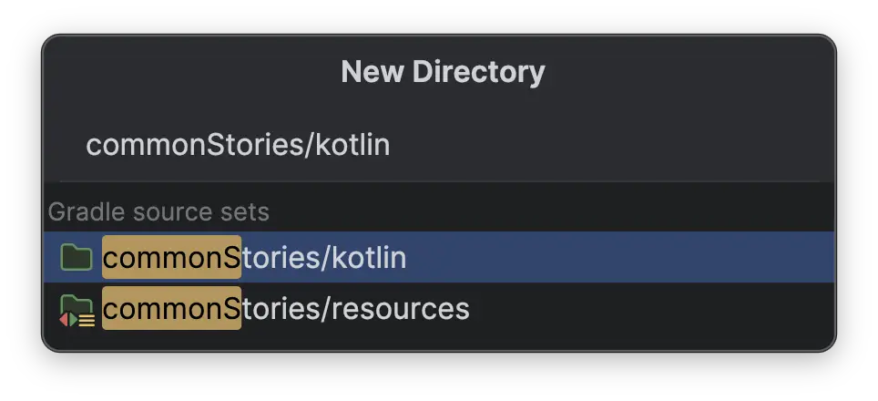
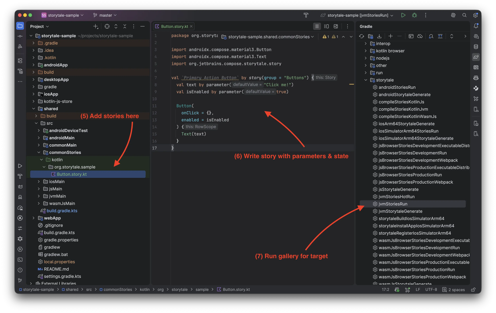

# Writing Your First Story

This guide walks through creating component stories step by step using a standard project generated from the [Kotlin Multiplatform Wizard (kmp.new)](https://kmp.new).

> **Prefer cloning a working project?** Clone the starter template: [github.com/aryapreetam/storytale-sample](https://github.com/aryapreetam/storytale-sample)

---

## 1. Project Generation via kmp.new

Navigate to [kmp.new](https://kmp.new) and configure your project:



### Wizard Settings

| Setting | Value | Notes |
| :--- | :--- | :--- |
| **Project Name** | `storytale-sample` | Standard project directory identifier. |
| **Project ID** | `org.storytale.sample` | Base package name for multiplatform sources. |
| **Build System** | **Gradle** | Storytale integrates directly into the Gradle Multiplatform toolchain. |
| **UI Targets** | Android, iOS, Desktop, Web | Select "Share UI via Compose Multiplatform" across targets. |

Download, unzip, and open the project in IntelliJ IDEA or Android Studio.

---

## 2. Project Structure & Plugin Setup

The generated `storytale-sample` project organizes shared UI and platform host targets cleanly:

```text
storytale-sample/
├── gradle/
│   └── libs.versions.toml
├── shared/
│   ├── build.gradle.kts          # Multiplatform configuration & Storytale plugin
│   └── src/
│       ├── commonMain/kotlin/    # Production Compose UI components
│       ├── androidMain/kotlin/
│       ├── jvmMain/kotlin/
│       └── wasmJsMain/kotlin/
├── androidApp/                   # Android application host
├── desktopApp/                   # Desktop JVM application host
├── webApp/                       # Wasm Browser application host
└── iosApp/                       # Xcode project & iOS application host
```

Open `shared/build.gradle.kts` and apply the Storytale plugin:

=== "gradle/libs.versions.toml"

    ```toml
    [versions]
    storytale = "0.0.7"

    [plugins]
    storytale = { id = "io.github.aryapreetam.storytale", version.ref = "storytale" }
    ```

=== "shared/build.gradle.kts"

    ```kotlin
    plugins {
      alias(libs.plugins.kotlinMultiplatform)
      alias(libs.plugins.androidMultiplatformLibrary)
      alias(libs.plugins.composeMultiplatform)
      alias(libs.plugins.composeCompiler)
      id("io.github.aryapreetam.storytale") version "0.0.7" // (1)
    }
    ```

We can also write `alias(libs.plugins.storytale)` if we have it defined in `libs.versions.toml`.

Click **Sync Now** in your IDE. Once synced, Storytale automatically hooks into your targets and registers gallery tasks:

<div class="step-comparison" markdown="1">
<div class="step-images-row" markdown="1">
<div class="step-before" markdown="1">



</div>
<div class="step-arrow">&rarr;</div>
<div class="step-after" markdown="1">



</div>
</div>
<div class="step-captions-row">
<div class="caption-before"><em>Apply plugin and configure targets in <code>shared/build.gradle.kts</code></em></div>
<div class="caption-arrow"></div>
<div class="caption-after"><em>Storytale tasks registered under <code>storytale</code> group</em></div>
</div>
</div>

- **(1) Apply Storytale Plugin**: Added to the shared multiplatform module `plugins { ... }` block.
- **(2) Multiplatform UI Targets**: Storytale configures galleries across all declared targets (`android`, `jvm`, `wasmJs`, `ios`).
- **(3) Shared Compose Dependencies**: Common UI libraries and dependencies declared in `commonMain` are directly available to your stories.
- **(4) Automatic Task Generation**: Tasks for code generation and running galleries appear in the Gradle tool window under the `storytale` task group.

!!! tip "Android Device Test Manifest & `.gitignore`"
    Storytale automatically synthesizes `shared/src/androidDeviceTest/AndroidManifest.xml` during Gradle execution to configure the instrumented APK runner for ADB. Because this file is generated on-the-fly and removed by `./gradlew clean`, add it to your `.gitignore`:

    ```gitignore
    **/src/androidDeviceTest/AndroidManifest.xml
    ```

---

## 3. Define Your First Story

<div class="stories-dir-helper-row" markdown="1">
<div class="stories-dir-helper-text" markdown="1">

Stories live in the `commonStories` source set, parallel to `commonMain`. In IntelliJ IDEA or Android Studio, right-click `shared/src` &rarr; **New** &rarr; **Directory**. Enter `commonStories` as the directory name.

The IDE helper suggests available source roots: select `commonStories/kotlin`. Inside this directory, create the package folder structure matching your project ID (e.g. `org/storytale/sample/`).

</div>
<div class="stories-dir-helper-img" markdown="1">



</div>
</div>



- **(5) Add stories here**: Create story files inside `shared/src/commonStories/kotlin/` using the `.story.kt` extension (e.g. `Button.story.kt`).
- **(6) Write story with parameters & state**: Define stories using Kotlin backtick identifiers (`` `Primary Action Button` ``) and interactive knobs (`val text by parameter("Click me!")`).
- **(7) Run gallery for target**: Double-click any of the target-specific story tasks from the Gradle tool window (e.g. `jvmStoriesRun`, `wasmJsBrowserStoriesDevelopmentRun`) or execute them via terminal.

Create `shared/src/commonStories/kotlin/org/storytale/sample/Button.story.kt`:

```kotlin
package org.storytale.sample

import androidx.compose.material3.Button
import androidx.compose.material3.Text
import org.jetbrains.compose.storytale.story

val `Primary Action Button` by story(group = "Buttons") {
  val text by parameter("Click me!")
  val isEnabled by parameter(true)

  Button(
    onClick = {},
    enabled = isEnabled
  ) {
    Text(text)
  }
}
```

---

## 4. Run the Gallery

Run the interactive gallery on any platform target from the Gradle tool window or via CLI. Each platform provides a dedicated gallery runner:

=== "Desktop (JVM)"

    ```bash
    ./gradlew :shared:jvmStoriesRun
    ```

    Launches a native desktop window running the Compose Multiplatform gallery.

    
    

=== "Web (Wasm)"

    ```bash
    # Local development server with HMR
    ./gradlew :shared:wasmJsBrowserStoriesDevelopmentRun

    # Build production distribution for static hosting
    ./gradlew :shared:wasmJsBrowserStoriesProductionExecutableDistribution
    ```

    Starts a local development server or compiles optimized web assets ready for static hosting.

    <div class="wasm-gallery-wrapper" data-gallery-url="https://aryapreetam.github.io/storytale-sample/">
      <div class="storytale-gallery-fallback">
        
        
      </div>
      <div class="storytale-gallery-container" style="display: none;">
        <div class="storytale-gallery-header">
          <div class="dots">
            <span class="dot"></span>
            <span class="dot"></span>
            <span class="dot"></span>
          </div>
          <span>Storytale Sample &mdash; Web (Wasm)</span>
          <a class="storytale-gallery-link" href="https://aryapreetam.github.io/storytale-sample/" target="_blank" rel="noopener" style="font-size: 0.8rem;">Open Fullscreen &nearr;</a>
        </div>
        <iframe class="storytale-gallery-iframe" data-src="https://aryapreetam.github.io/storytale-sample/" title="Storytale Sample Wasm Gallery" sandbox="allow-scripts allow-same-origin allow-forms allow-popups"></iframe>
      </div>
    </div>

    > **Live Starter Gallery**: Hosted directly from the sample's production distribution at [aryapreetam.github.io/storytale-sample](https://aryapreetam.github.io/storytale-sample/).

=== "Android"

    ```bash
    ./gradlew :shared:androidStoriesRun
    ```

    Builds the gallery test APK, installs it to your connected device or emulator via ADB, and launches the gallery activity.

    <div class="mobile-gallery-row only-light">
      <figure>
        
        <figcaption>Story Preview</figcaption>
      </figure>
      <figure>
        
        <figcaption>Story Navigation</figcaption>
      </figure>
      <figure>
        
        <figcaption>Interactive Parameters</figcaption>
      </figure>
    </div>
    <div class="mobile-gallery-row only-dark">
      <figure>
        
        <figcaption>Story Preview</figcaption>
      </figure>
      <figure>
        
        <figcaption>Story Navigation</figcaption>
      </figure>
      <figure>
        
        <figcaption>Interactive Parameters</figcaption>
      </figure>
    </div>

=== "iOS Simulator"

    ```bash
    # Apple Silicon (M1/M2/M3/M4)
    ./gradlew :shared:iosSimulatorArm64StoriesRun

    # Intel Mac (x86_64) — requires CMP 1.10 profile
    ./gradlew :shared:iosX64StoriesRun -PcmpProfile=1.10
    ```

    Compiles the native iOS binary, installs it to the booted iOS simulator, and launches the gallery. Compose Multiplatform 1.11+ dropped `iosX64` binaries; pass `-PcmpProfile=1.10` when targeting Intel-based Mac simulators.

    <div class="mobile-gallery-row only-light">
      <figure>
        
        <figcaption>Story Preview</figcaption>
      </figure>
      <figure>
        
        <figcaption>Story Navigation</figcaption>
      </figure>
      <figure>
        
        <figcaption>Interactive Parameters</figcaption>
      </figure>
    </div>
    <div class="mobile-gallery-row only-dark">
      <figure>
        
        <figcaption>Story Preview</figcaption>
      </figure>
      <figure>
        
        <figcaption>Story Navigation</figcaption>
      </figure>
      <figure>
        
        <figcaption>Interactive Parameters</figcaption>
      </figure>
    </div>

---

??? note "Grouping & Organizing Stories"

    Organize stories hierarchically using slashes in the `group` parameter:

    ```kotlin
    val `Primary Button` by story(group = "Components/Buttons") {
      Button(onClick = {}) { Text("Primary") }
    }

    val `Secondary Button` by story(group = "Components/Buttons") {
      OutlinedButton(onClick = {}) { Text("Secondary") }
    }

    val `Text Input` by story(group = "Components/Inputs") {
      TextField(value = "", onValueChange = {})
    }
    ```

    The gallery navigation tree mirrors these group paths, allowing large design systems to be structured cleanly into categories and subcategories.

??? info "How Compile-Time Registration Works"

    Storytale eliminates manual story registration and runtime reflection:

    1. **Compiler Plugin Detection**: The Storytale Kotlin compiler plugin scans `commonStories` during compilation for `by story(...)` property delegates.
    2. **Synthetic Code Generation**: It generates platform-specific registration code that collects all story metadata, parameters, and composable content blocks.
    3. **Target Entry Point Generation**: For each enabled target (JVM, Android, Wasm, iOS), Storytale synthesizes an isolated gallery application entry point containing the full story catalog, navigation sidebar, and parameter inspector.
    4. **Zero Production Overhead**: Story code and test runners live exclusively in `commonStories` and never pollute release binaries or production source sets.

---

## Next Steps

- **[storytale-sample Starter](https://github.com/aryapreetam/storytale-sample)**: Clone the pre-configured starter repository with all targets enabled.
- **[gallery-demo Showcase](https://github.com/aryapreetam/storytale/tree/main/gallery-demo)**: Explore full-featured story suites with complex states, animations, and custom themes in the sample project, or test drive the [Live Web Showcase](https://aryapreetam.github.io/storytale/gallery/).
- **[Interactive Parameters](../guides/parameters.md)**: Expose editable knobs, booleans, dropdowns, and color pickers in the gallery inspector sidebar.
- **[Decorators & Theming](../guides/decorators.md)**: Wrap stories with theme providers, padding, surface containers, and device frame previews.
- **[Multiplatform Workflows](../guides/multiplatform.md)**: Configure target architecture, source set inheritance, and CI deployment pipelines.
