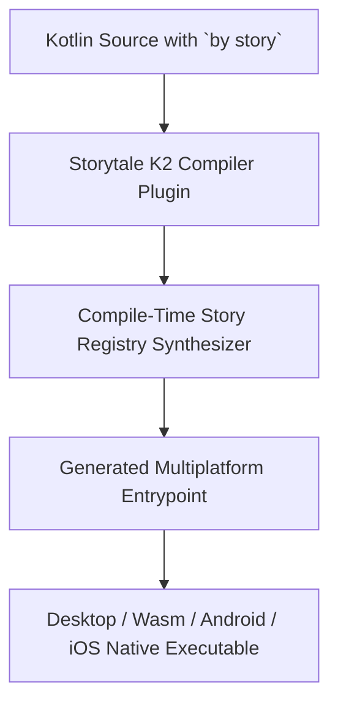

# Writing Your First Story

In Storytale, a **Story** represents an isolated instance of a composable component with a specific set of props, states, or variations.

---

## 1. Defining a Story

Stories are defined as top-level Kotlin properties using the `by story` delegate from `storytale.story`:

```kotlin
package com.example.ui.stories

import androidx.compose.material3.Button
import androidx.compose.material3.Text
import androidx.compose.runtime.Composable
import storytale.story

val `Primary Button Default` by story(
    group = "Buttons",
    description = "Standard primary button in default state"
) {
    Button(onClick = {}) {
        Text("Click Here")
    }
}
```

### Story Parameters Breakdown

The `story(...)` builder accepts the following parameters:

| Parameter | Type | Default | Description |
| :--- | :--- | :--- | :--- |
| `name` | `String?` | `null` | Story title. If omitted, Storytale derives the title directly from the Kotlin property identifier. |
| `group` | `String` | `"Default"` | Category hierarchy in the gallery navigation tree (e.g. `"Components/Inputs"`). |
| `description` | `String?` | `null` | Contextual documentation rendered in the gallery header. |
| `content` | `@Composable () -> Unit` | *(Required)* | The composable layout rendered within the preview canvas. |

---

## 2. Organizing Story Groups

You can structure your design system hierarchy using slash-separated or nested groups:

```kotlin
package com.example.ui.stories

import androidx.compose.material3.OutlinedButton
import androidx.compose.material3.Text
import storytale.story

val `Outlined Button` by story(group = "Actions/Buttons") {
    OutlinedButton(onClick = {}) {
        Text("Secondary Action")
    }
}

val `Danger Button` by story(group = "Actions/Buttons") {
    Button(
        onClick = {},
        colors = ButtonDefaults.buttonColors(containerColor = MaterialTheme.colorScheme.error)
    ) {
        Text("Delete Item")
    }
}
```

In the Storytale sidebar, these automatically nest under an `Actions` category with a `Buttons` submenu.

---

## 3. Running Your Gallery

Once your stories are defined, Storytale synthesizes a standalone gallery executable for your active targets.

### Desktop (JVM)
Run the desktop window immediately with hot reload support:
```bash
./gradlew :desktopStoriesRun
```

### Web (Wasm)
Launch a local development server or generate a production static distribution:
```bash
# Local development server with auto-refresh
./gradlew :wasmJsBrowserStoriesRun

# Production static site bundle (outputs to build/dist/wasmJs/productionExecutable/)
./gradlew :wasmJsBrowserStoriesProductionExecutableDistribution
```

### Android Emulator or Physical Device
Deploys and launches the Storytale gallery activity to an active ADB device or emulator:
```bash
./gradlew :androidStoriesRun
```

### iOS Simulator
Boots the iOS simulator, builds the application framework, and launches the gallery app:
```bash
# Apple Silicon (M1/M2/M3/M4)
./gradlew :iosSimulatorArm64StoriesRun

# Intel Mac (x86_64)
./gradlew :iosX64StoriesRun
```

---

## 4. How Story Registration Works



1. **FIR Analysis**: During compilation, the Storytale compiler plugin identifies calls to `by story`.
2. **Metadata Extraction**: It collects groups, names, and parameter bindings from the FIR syntax tree.
3. **Synthetic Registration**: At the final compilation stage, it generates a static registration list without runtime reflection.

---

## Next Steps

Learn how to configure inputs in **[Interactive Parameters](../guides/parameters.md)**.
