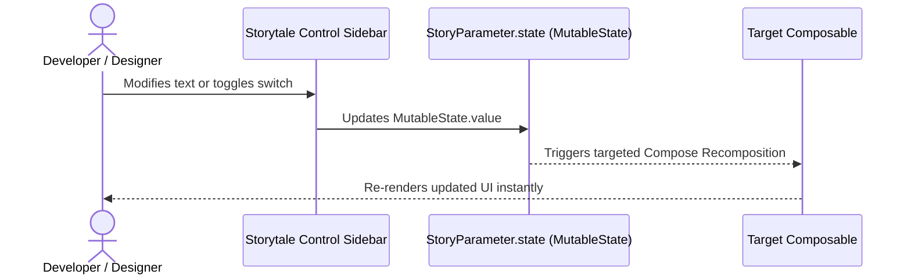

# Interactive Parameters & State

Storytale provides interactive parameter controls. Instead of hardcoding props or creating separate variants for different states, you can expose parameters that can be adjusted directly from the gallery UI.

---

## 1. Defining Parameters with `parameter()`

Within a story definition block (which provides a `Story` receiver), you can declare parameters using Kotlin property delegation:

```kotlin
import androidx.compose.material3.Button
import androidx.compose.material3.Text
import org.jetbrains.compose.storytale.story

val `Interactive Button` by story(group = "Controls/Buttons") {
  val text by parameter("Click Me")
  val isEnabled by parameter(true)

  Button(
    onClick = {},
    enabled = isEnabled
  ) {
    Text(text)
  }
}
```

When you select this story in the Storytale gallery, the sidebar automatically generates:
- A text input field for `text`.
- A toggle switch for `isEnabled`.

Editing these controls updates the composable state immediately without recompilation.

<div class="mobile-gallery-row only-light">
  <figure>
    
    <figcaption>Android Parameter Controls</figcaption>
  </figure>
  <figure>
    
    <figcaption>iOS Parameter Controls</figcaption>
  </figure>
</div>
<div class="mobile-gallery-row only-dark">
  <figure>
    
    <figcaption>Android Parameter Controls</figcaption>
  </figure>
  <figure>
    
    <figcaption>iOS Parameter Controls</figcaption>
  </figure>
</div>

---

## 2. Parameter Types

Storytale supports automatic UI control synthesis for multiple parameter types:

### Primitive Types
```kotlin
// Text input control
val title by parameter("Hello World")

// Boolean switch control
val isVisible by parameter(true)

// Numeric inputs
val count by parameter(42)
val elevation by parameter(8.0f)
```

### Discrete Options (List / Selection)
To restrict an input to a predefined list of allowed values, supply a `List<T>`:

```kotlin
val variant by parameter(
  values = listOf("Filled", "Outlined", "Elevated", "Tonal"),
  defaultValueIndex = 0,
  label = "Button Style"
)
```

This renders selection chips in the gallery sidebar:

<figure style="width: 90%; margin: 1em auto;">
  
  
  <figcaption>Selection chips generated automatically for <code>List&lt;T&gt;</code> parameters</figcaption>
</figure> 

### Enum Types
Enums are automatically converted to discrete options using Kotlin's `enumEntries`:

```kotlin
enum class BadgePriority { Low, Medium, High, Critical }

val priority by parameter(
  defaultValue = BadgePriority.Medium,
  label = "Badge Severity"
)
```

<figure>
  
  
  <figcaption>Selection chips generated automatically from Kotlin enum types</figcaption>
</figure>

---

## 3. Using `@Preview` with `previewParameter`

If you develop components using standard `@Preview` annotations (from Jetpack Compose or Compose Multiplatform), Storytale's compiler plugin can automatically convert previews into interactive stories.

Inside any `@Preview` composable, use `previewParameter`:

```kotlin
import androidx.compose.desktop.ui.tooling.preview.Preview
import androidx.compose.material3.Button
import androidx.compose.material3.Text
import androidx.compose.runtime.Composable
import org.jetbrains.compose.storytale.previewParameter

@Preview
@Composable
fun PreviewActionButton() {
  val title by previewParameter("Submit Order")
  val enabled by previewParameter(true)

  Button(onClick = {}, enabled = enabled) {
    Text(title)
  }
}
```

`previewParameter` accesses the active `LocalStory` composition local provided by Storytale's gallery host, falling back safely to default values when rendered in standard IDE preview tooling.

---

## 4. How State Reactivity Works

Storytale parameters are backed by Compose `MutableState<T>`:



Because controls bind directly to Compose snapshot state, parameter changes only recompose the specific nodes reading the parameter.

---

## Next Steps

Explore wrapping your stories with consistent design system scaffolding in **[Decorators & Theming](decorators.md)**.
